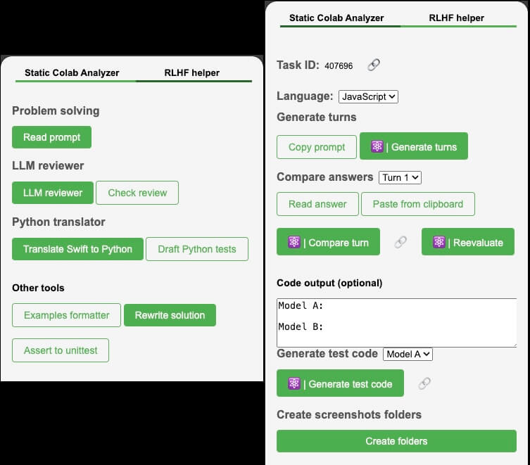

# Colab Static Reviewer & RLHF Helper



## Description

The ***Colab Static Reviewer & RLHF Helper*** is a powerful tool designed to ensure that your Google Colab files are well-formatted. This tool not only checks the formatting but also enhances your workflow with the RLHF (Reinforcement Learning from Human Feedback) helper functionalities.

### Features

- **Google Colab Formatting Checker**:
  - Automatically checks if your Colab notebooks are formatted correctly.
  - Translate (static code, not AI) the `unittest` cases from Swift to Python.
- **RLHF Helper**: 
  - Copy prompts with a single click.
  - Generate conversation turns using AI in the backend.
  - Compare AI-generated responses in the backend (Claude 3.5).
  - Re-evaluate responses and generate test code to verify functionality.
  - Automatically paste content from the backend into the DOM for easy manual review.
- **Google Drive Integration**: Create folders in Google Drive and upload screenshots of each turn in a generated dropdown area.

## Installation Steps

1. Clone the repository or download the source code.
2. Navigate to the project directory.
3. Run the following command to build the project:
   ```bash
   npm run build
   ```
4. Open Chrome and go to `chrome://extensions/`.
5. Enable "Developer mode" in the top right corner.
6. Click on "Load unpacked" and select the `dist` folder from your project.

## Usage

Once installed, you can start using the Colab Static Reviewer & RLHF Helper directly in your Google Colab environment. Follow the on-screen instructions to utilize the various features of the tool.
